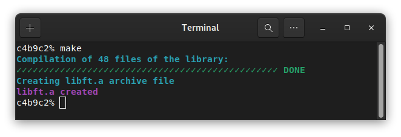

  

# libft

The project is about creating its own library that will be used for the whole 42 curriculum. 
The only external functions that are allowed are `write()`, `malloc()` and `free()`. 

# Downloading and compiling the library

Clone the library and use `make` to compile
```
git clone https://github.com/theozanchi/42_Berlin_libft/tree/main
cd 42_Berlin_libft
make
```



# Integrating the library in your project

Use this code in your Makefile to add the library
```
LIBFT       =	libft.a
LIBFT_DIR   =	./libft/
${LIBFT}:
            @echo "${CYAN}\nCOMPILING $$(echo ${LIBFT} | tr '[:lower:]' '[:upper:]')${NC}"
            @if [ -d ${LIBFT_DIR} ]; \
            then git -C ${LIBFT_DIR} pull; \
            else git clone git@github.com:theozanchi/42_Berlin_libft.git ${LIBFT_DIR}; \
            fi
            make -C ${LIBFT_DIR}
```

Remember to also include the library when compiling your project C files: `${LIBFT_DIR}${LIBFT}`

